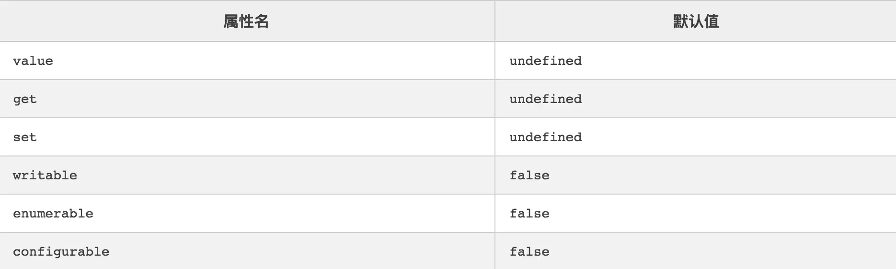

# data响应式原理

# Object.defineProperty

一个原生的 js对象方法。这个方法可以说是vue2实现数据响应式的核心了。 当然，在vue3中用proxy对该方法进行了替换改写，因为 defineProperty 也有自己的缺陷，例如无法监听引用数据中属性的变化等等。

## 基本概念

> Object.defineProperty(obj, prop, descriptor)
> 

object.defineProperty 方法接收三个参数，分别是目标对象，目标属性，属性描述符。

obj 指定需要进行操作的对象。 prop 指定该对象中需要操作的属性名，如果传入的目标属性不存在，则会创建该属性。 descriptor 你所定义的对目标属性进行的操作。

重点要讲的时第三个属性descriptor

## descriptor

使用 object.defineProperty 为对象定义属性有两种形式，且不能混用：

1. 数据描述符
2. 存取描述符

### 数据描述符

数据描述符定义时，特有两个属性：

- **value**: 定义属性的 value 值
- **writable**: 定义value是否能被改变，默认值为 `false`

```jsx
let Person = {}
Object.defineProperty(Person, 'name', {
   value: 'jack', 
   writable: true // 是否可以改变
})
```

### 存取描述符

利用一对getter、setter 函数功能来描述的属性：

- **get**: 一个给属性提供 getter 的方法，如果没有 getter 则为 undefined 。该方法返回值被用作属性值。默认为undefined。
- **set**: 一个给属性提供 setter 的方法，如果没有setter 则为 undefined。该方法将接受唯一参数，并将该参数的新值分配给该属性。默认值为 undefined

```jsx
let Person = {}
let temp = null
Object.defineProperty(Person, 'name', {
  get: function () {
    return temp
  },
  set: function (val) {
    temp = val
  }
})
```

### 注意点

以下时描述符中拥有的属性和默认值，一般在使用 descriptor 定义属性时忽略了某些属性，就会赋予默认值。



但是，注意：只是使用 descriptor 对属性进行定义时会采用以上的默认值，如果是直接赋值方式:

```jsx
let Person = {}Person.name = 'Kerwin'// -------------等价于👇----------------Object.defineProperty('Person', 'name', {  value: 'Kerwin',  writable: true,  configurable: true,  enumerable: true})
```

直接赋值默认会将 descriptor 中的所有权限属性开放。

# Object.getOwnPropertyDescriptor